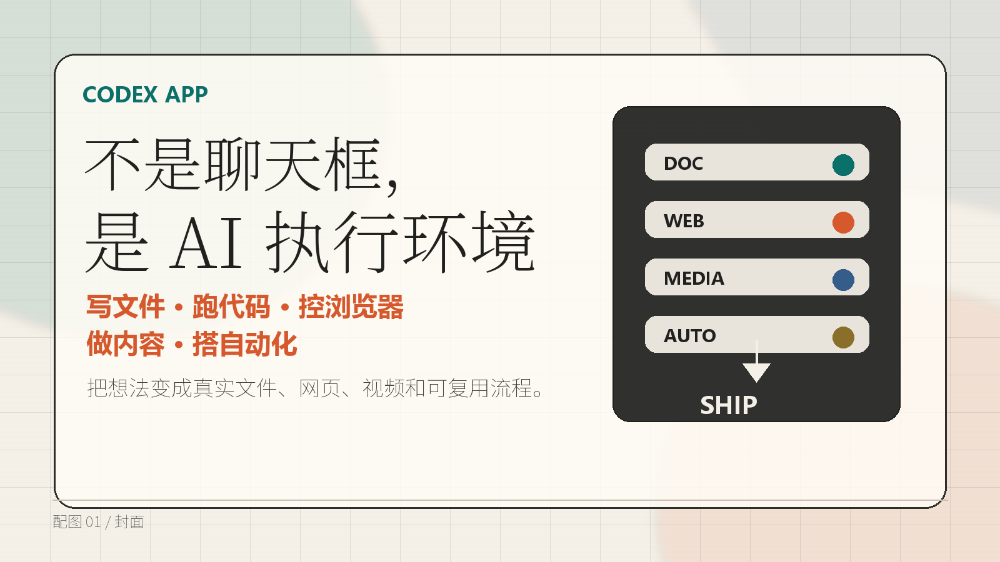
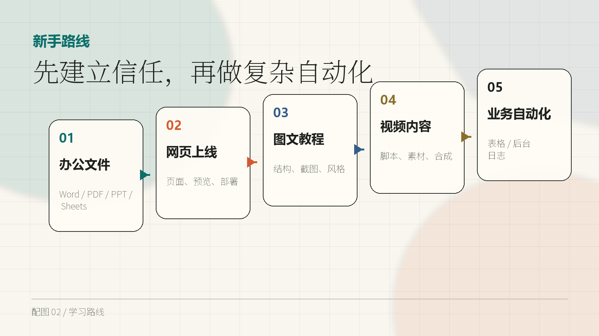
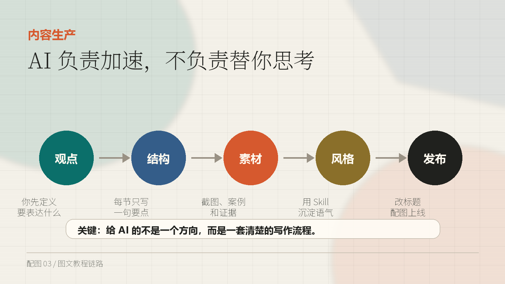
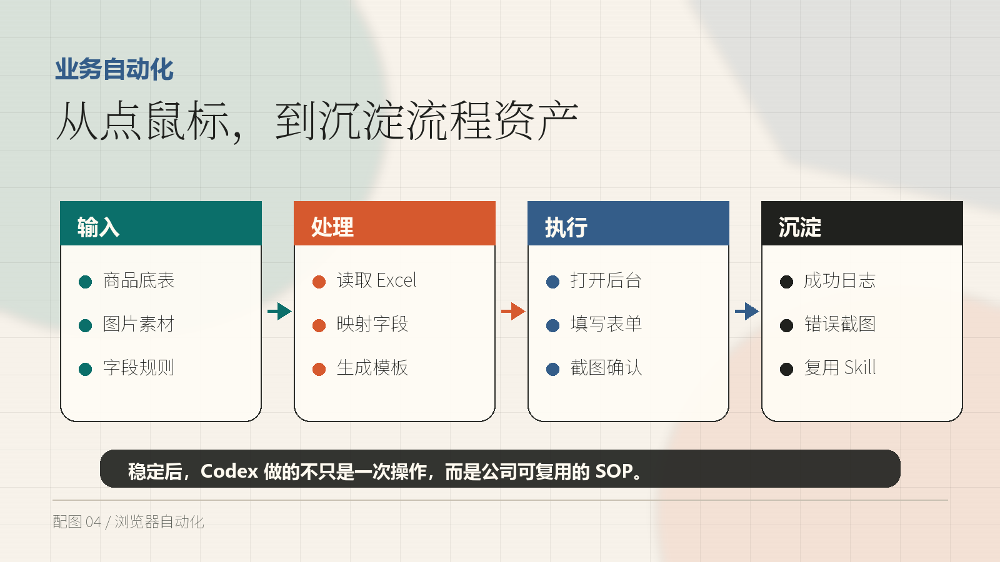

# Codex App X 改写草稿

## 标题候选

推荐标题：

> Codex App 不是聊天框，而是一个能帮你干活的 AI 执行环境

标题图片：

其他可选标题：

1. 我重新理解了 Codex App：它真正值钱的不是聊天，而是执行
2. Codex App 实战路线：从办公文件到浏览器自动化
3. 如果你只拿 Codex App 聊天，真的浪费了
4. 普通人怎么把 Codex App 用成生产力工具
5. Codex App 的 5 层用法：文件、网页、内容、视频、自动化
6. 会用 Codex App 的人，已经开始把重复工作变成自动化流程
7. 从写文件到跑业务流程：Codex App 的正确打开方式
8. Codex App 入门后，真正该练的是这 5 个场景

## 发布建议

建议在首条或末条保留来源，例如：

> 灵感来自 @gengdaJ 关于 Codex App 实战场景的长文，我按自己的使用理解重新整理了一版。

不要把这版包装成“完全原创发现”。更稳妥的定位是：读后整理、个人实践路线、方法论拆解。

## X 规则合规检查

这篇发布前重点检查 4 件事：

1. 版权：不要搬运原文截图、原文配图或大段原文。当前配图为自制示意图，可以使用。
2. 来源：建议保留“灵感来自 @gengdaJ ...”这类来源说明，避免被理解成完整原创发现。
3. 真实性：不要写成 Codex 官方承诺、收益承诺或保证效果。用“我理解”“我建议”“适合尝试”这类表达更稳。
4. 平台操纵：不要暗示用自动化刷赞、刷评论、批量注册、批量骚扰或操纵 X 流量。本文里的自动化应限定为文件、网页、业务后台和个人工作流。

发布时避免：

- “保证赚钱”“无脑赚钱”“稳赚”；
- 冒充 Codex/OpenAI 官方；
- 使用别人未经授权的截图、头像、隐私信息；
- 引导读者批量刷互动或规避平台风控。

## 配图清单

建议使用 4 张原创配图：

- 配图 01：封面，放在第 1 条。
- 配图 02：学习路线，放在第 2 条。
- 配图 03：内容生产链路，放在第 5 条。
- 配图 04：业务自动化链路，放在第 7 条。

## X 文章发布版：9 条 Thread

1/

[配图：assets/codex-x/01-cover.png]

如果你只把 Codex App 当成“桌面版 ChatGPT”，基本只用了它很小一部分能力。

我这段时间重新理解了一遍：

Codex App 真正有价值的地方，不是回答问题。

而是把写文件、跑代码、做网页、控浏览器、搭自动化，连成一个能交付结果的 AI 执行环境。

2/

[配图：assets/codex-x/02-learning-ladder.png]

新手别一上来就挑战复杂自动化。

更稳的路线是 5 层：

1. 生成办公文件
2. 做网页和可视化
3. 生产图文教程
4. 制作视频内容
5. 跑浏览器自动化

前两层建立信任，后三层才开始接近真实生产力。

3/

第一层：办公文件。

让 Codex 生成 Word、PDF、PPT、XLSX，不只是炫技。

重点是它能真实落文件、检查文件、给路径、做验收。

普通聊天模型很多时候只给你一段文字。

Codex 更像是：把任务做完，然后把结果放到你电脑里。

4/

第二层：网页和 PPT。

这里有两个很适合练手的方向：

一种是 HTML 页面：写代码、预览、改样式、部署上线。

另一种是 HTML 型 PPT：用 HTML/CSS/JS 写幻灯片，方便动画、截图、录屏和复用。

这类任务能快速建立你对 Codex 的信任。

5/

[配图：assets/codex-x/03-content-chain.png]

第三层：图文教程。

很多人用 AI 写文章失败，不是因为模型太弱。

而是输入太空。

不要只说“帮我写一篇 XX”。

你要给它：

核心观点、读者是谁、每节要点、截图需求、风格样例。

AI 负责加速，不负责替你思考。

6/

如果你经常做自媒体，最值得沉淀的是自己的写作 Skill。

把你过去写得好的文章、标题、段落节奏、口头禅、排版习惯整理进去。

这样 Codex 就不是泛泛地写“AI 味文章”。

而是沿着你的表达方式，帮你更快完成选题、结构、初稿、配图和改稿。

7/

[配图：assets/codex-x/04-automation-flow.png]

第四层和第五层，才是真正接近商业价值的地方：

视频内容和浏览器自动化。

视频方向，Codex 可以串起脚本、素材、音频、动画、剪辑、导出。

自动化方向，Codex 可以读表格、映射字段、填后台、截图确认、输出日志。

这不是“帮我点几下鼠标”，而是把流程产品化。

8/

我现在对 Codex App 的理解是：

它不是一个聊天框，而是一个 AI 执行环境。

你越能把任务拆清楚，它越能稳定执行。

你只给一个模糊愿望，它就只能给你一个看起来完整、实际难用的结果。

工具的上限，很多时候取决于使用者会不会定义任务。

9/

TL;DR：

- 不要把 Codex 只当聊天工具
- 先从文件、网页、PPT 建立信任
- 再做图文教程、视频和自动化
- 真正有价值的是把重复流程沉淀成可复用工作流

灵感来自 @gengdaJ 的 Codex App 实战分享，我按自己的理解重组了一版。

如果你也在用 Codex，评论区可以说一个你最想自动化的重复工作。

## 单条短帖版本

很多人把 Codex App 当成桌面版 ChatGPT 用，其实很浪费。

它真正强的地方是：能写文件、跑代码、查项目、开浏览器、调用工具，把“想法 -> 执行 -> 验收”串起来。

新手可以按这个顺序练：

生成办公文件 -> 做网页 -> 本地预览 -> 部署上线 -> 图文教程 -> HTML PPT -> 视频内容 -> 浏览器自动化。

真正有长期价值的不是“会用 AI 聊天”，而是把重复流程沉淀成可复用的自动化工作流。

灵感来自 @gengdaJ 的 Codex App 实战分享，我按自己的理解重新整理了一版。
